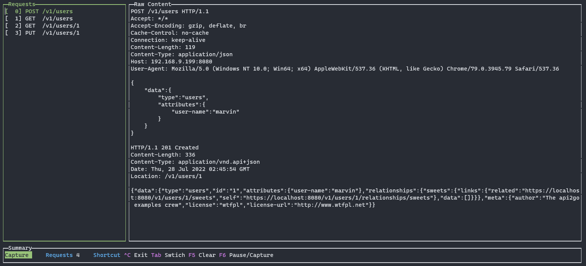

## httpcap

[](https://opensource.org/licenses/MIT)

Parse and display http traffic from network device or pcap file. This is a go version of origin pcap-parser, thanks to gopacket project, this tool has simpler code base and is more efficient.

## Dependency

httpcap uses libpcap, a system-independent interface for user-level packet capture,Before use httpcap, you must first install libpcap

for ubuntu/debian:

```shell
sudo apt install libpcap-dev
```

for centos/redhat/fedora:

```shell
sudo yum install libpcap-devel
```

## Installation

```shell
$ go install github.com/uole/httpcap@latest
```

## Usage

```shell
Usage of httpcap:
  -assembly_debug_log
        If true, the github.com/google/gopacket/reassembly library will log verbose debugging information (at least one line per packet)
  -assembly_memuse_log
        If true, the github.com/google/gopacket/reassembly library will log information regarding its memory use every once in a while.
  -f string
        packet filter in libpcap filter syntax
  -host string
        filter http request host, using wildcard match(*)
  -i string
        name of interface (default "eth0")
  -ip string
        filter source or target ip
  -p int
        filter source or target port
  -l    list of interfaces and exit
  -v    display version info and exit
```


## Example

#### list interfaces

```shell
root@localhost:~# httpcap -l
Name                                 Description
veth4917cfa
veth5fba3eb
veth93a23daf
vethf578bde
eth0
```

#### http capture

```shell
$ httpcap -i eth0 
```




